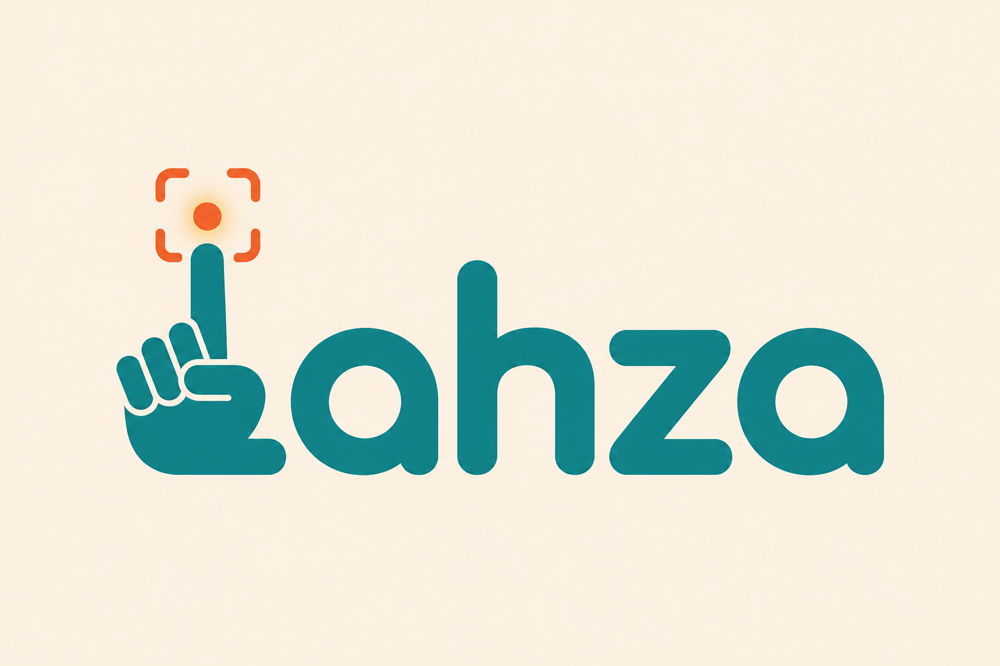
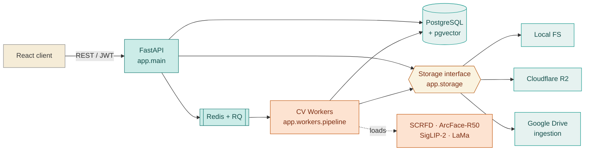
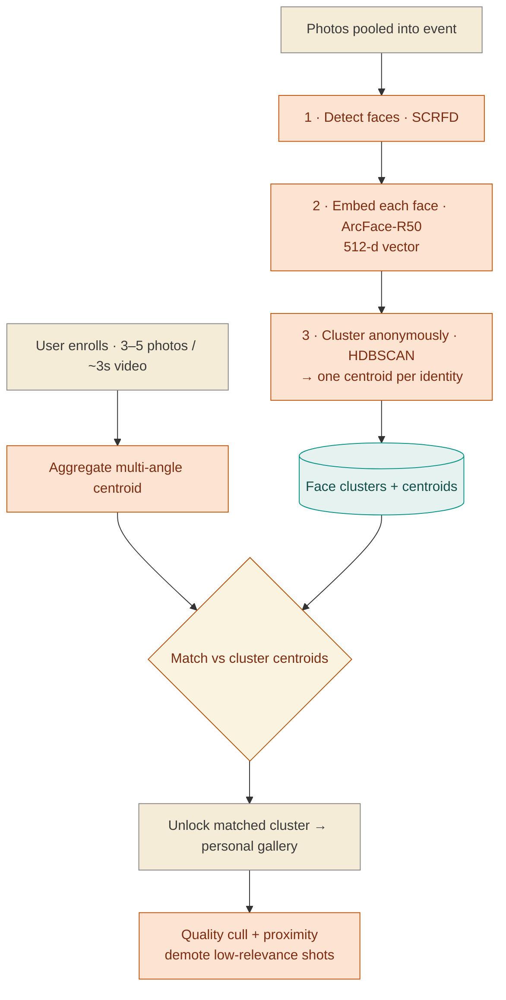

<div align="center">



# Lahza · لحظة — Backend

**FastAPI service + async CV workers** for personalized event photo galleries.

*Pool everyone's photos into one event; each person gets a private gallery of only the photos they're verified in — powered by a custom face-recognition pipeline, not a third-party API.*


[Overview](#-overview) · [Architecture](#-architecture) · [Pipeline](#-cv-pipeline) · [Setup](#-setup) · [API](#-api-reference) · [Evaluation](#-evaluation) · [Frontend ↗](https://github.com/la2etha/la2etha-frontend)

</div>

---

> [!NOTE]
> **Companion repo:** the React web client lives in **[`la2etha-frontend`](https://github.com/la2etha/la2etha-frontend)** — run this backend and at least one worker first, then point the frontend's `VITE_API_BASE_URL` at it.

---

## 🎯 Overview

Photos are pooled per event; each person gets a **private** gallery of only the photos they're verified in. Face detection, embedding, clustering, enrollment matching, quality culling, natural-language search, privacy export, and optional AI edit all run in Redis/RQ workers on the GPU box — the API stays responsive while the heavy CV work happens asynchronously.

The system is built to scale: rather than comparing every registered person against every discovered face (`O(people × faces)`), faces are **clustered once at upload time**, and each person's enrolled identity is matched against a handful of cluster centroids.

<div align="center"></div>

---

## 🏗 Architecture

The API accepts uploads and enqueues work; workers on the GPU box run the CV pipeline and persist faces, clusters, and gallery entries to one Postgres + `pgvector` store. Storage (photo bytes) sits behind a single interface with local-FS, R2, and Google-Drive-ingestion backends.



<details>
<summary><b>🔎 App layout</b></summary>

<br/>

```
app/
├── api/         REST routers: auth · events · photos · enrollment · gallery · search · export
├── access/      single access guard (identity-gated photo reads)
├── auth/        FastAPI-Users setup + login rate-limit
├── cv/          detect · embed · cluster · enroll · quality · proximity · search_embed · removal · edit_gemini
├── db/          SQLAlchemy models + async/sync engines
├── schemas/     Pydantic request/response models
├── services/    gallery · search · export orchestration
├── storage/     pluggable byte storage: local_fs · r2 · gdrive
└── workers/     RQ worker + the async CV pipeline
```

</details>

---

## 🧠 CV Pipeline

When photos are pooled, the worker runs the full pipeline; enrollment then unlocks each person's gallery in a single centroid match.



| Stage | Module | Detail |
|-------|--------|--------|
| **Detect** | `app/cv/detect.py` | SCRFD (InsightFace) — every face in every pooled photo |
| **Embed** | `app/cv/embed.py` | ArcFace-R50 → 512-d L2-normalized vector |
| **Cluster** | `app/cv/cluster.py` | HDBSCAN, benchmarked vs Chinese Whispers & DBSCAN |
| **Enroll & match** | `app/cv/enroll.py` | Multi-angle centroid aggregation, matched to cluster centroids |
| **Quality cull** | `app/cv/quality.py` | Variance-of-Laplacian (resolution-normalized) + blink + confidence |
| **Proximity** | `app/cv/proximity.py` | bbox-ratio + face-sharpness (Depth-Anything optional) |
| **Search** | `app/cv/search_embed.py` | SigLIP-2 multilingual embeddings (opt-in `search` extra) |
| **Privacy export** | `app/cv/removal.py` | LaMa local inpainting (opt-in `export` extra) |
| **AI edit** *(stretch)* | `app/cv/edit_gemini.py` | Gemini "Nano Banana", solo-photo-only, opt-in via key |

> [!IMPORTANT]
> Quality culling and proximity filtering are **non-destructive** — low-relevance photos are demoted to a secondary gallery section with a `demote_reason`, never hidden or deleted. Hosts can promote anything back.

---

## ⚙️ Setup

### Prerequisites

- **Postgres with `pgvector`** and **Redis**. `docker-compose.yml` provides both for local dev.
- The InsightFace `buffalo_l` model pack cached locally. A CUDA GPU (RTX 2060) is expected; CPU works but is slow.
- No external credentials are needed for the core (local-FS storage + email/password auth). OAuth / R2 / Gemini keys only enable their optional features.

### Install & run

```bash
# 1. Dependencies (editable install; add extras as needed)
pip install -e ".[dev]"          # add ".[search]" / ".[export]" / ".[eval]" / ".[cloud]"
```
```bash
# 2. Config — copy the example and fill in what you need
cp .env.example .env             # JWT secret, DB/Redis URLs, STORAGE_BACKEND, media path
```
```bash
# 3. Infra (Postgres + Redis) for local dev
docker compose up -d
```
```bash
# 4. Database schema
alembic upgrade head
```
```bash
# 5. API — OpenAPI docs at http://localhost:8000/docs
uvicorn app.main:app --reload
```
```bash
# 6. At least one CV worker (separate terminal, on the GPU box)
python -m app.workers.worker
```

Health check: `GET /health`.

### Optional feature extras

| Extra | Enables | Without it |
|-------|---------|-----------|
| `search` | SigLIP-2 semantic search (torch + transformers) | Search endpoint returns **503** |
| `export` | LaMa privacy removal (torch + simple-lama) | Export serves originals; removal returns **503** |
| `eval` | dlib reference for clustering baselines | numpy Chinese-Whispers still runs |
| `cloud` | Cloudflare R2 storage (boto3) | Local-FS / Google-Drive still work |

---

## 🔧 Configuration (`.env`)

Key settings — see `.env.example` for the full list and `app/config.py` for defaults.

| Var | Purpose |
|-----|---------|
| `DATABASE_URL` / `ALEMBIC_DATABASE_URL` | async (app) and sync (migrations) Postgres URLs |
| `REDIS_URL` | RQ broker |
| `JWT_SECRET` | token signing — **change in production** |
| `STORAGE_BACKEND` | `local_fs` (default), `r2`, or `gdrive` |
| `MEDIA_ROOT` | local-FS media path |
| `MAX_UPLOAD_BYTES` | per-file upload ceiling (default 25 MB) |
| `LOGIN_RATE_LIMIT` / `LOGIN_RATE_WINDOW_SECONDS` | login brute-force guard (0 disables) |
| `QUALITY_BLUR_MIN` / `PROXIMITY_AREA_MIN` / `PROXIMITY_SHARPNESS_MIN` | CV tuning knobs |
| `SEARCH_MODEL` | SigLIP-2 checkpoint for semantic search |
| `EDIT_SOLO_ONLY` | enforce solo-photo AI edit (default on) |
| `GEMINI_API_KEY` | enables AI edit (optional; blank = disabled) |

---

## 🔌 API Reference

Interactive docs + schemas at **`/docs`**. High-level surface:

| Method & Path | Purpose |
|---------------|---------|
| `POST /auth/register` · `POST /auth/jwt/login` · `GET /users/me` | Auth (FastAPI-Users, JWT) |
| `POST /events` · `POST /events/join` · `GET /events/{id}` · `DELETE /events/{id}` | Events (host-only delete cascades DB rows **and** stored bytes) |
| `POST /events/{id}/photos` · `GET /events/{id}/photos/processing` | Photo pooling + progress |
| `POST /events/{id}/enroll` · `DELETE /users/me/identity` | Identity enrollment |
| `GET /events/{id}/gallery` · `GET /events/{id}/gallery/search` · `GET /photos/{id}` | Private gallery reads |
| `GET /photos/{id}/faces` | Detected-face bboxes (normalized 0..1) + `is_me` flag (trust toggle) |
| `POST` / `DELETE /photos/{id}/claim` | Manual "this is me" correction |
| `POST /photos/{id}/export` | Privacy removal of strangers' faces (optional) |
| `POST /photos/{id}/edit` | AI edit — solo photos only, consent required (optional) |
| `GET /events/{id}/demoted` · `.../promote` · `GET /events/{id}/pool` | Host-only |

> [!WARNING]
> **Access isolation.** Every photo read resolves through a single guard (`app/access/guard.py`) — a caller may read a photo only if they have a gallery entry for it or are the host; otherwise it returns **404**, never revealing the photo exists.

---

## 🧪 Tests

```bash
pytest                    # unit + integration
```

Integration tests need Postgres + `pgvector`; they **skip cleanly** when it's unreachable and run against a separate `<db>_test` database (so `pytest` never wipes dev data). Non-trivial CV/security modules also carry a runnable self-check — e.g. `python -m app.auth.ratelimit`, `python -m app.cv.edit_gemini`.

---

## 📊 Evaluation

The `eval/` harness reports:

- **Gallery recall / precision** — did each person get their photos, and only theirs?
- **Clustering quality** — HDBSCAN vs Chinese Whispers vs DBSCAN (purity / homogeneity).
- **Enrollment ablation** — single- vs multi-angle identity centroids.
- **Culling precision / recall** and public-dataset sanity checks (LFW / CFP-FP / AgeDB / WIDER).

`eval/REPORT.md` is the generated summary. See `eval/` for the dataset loaders and metric functions.

---

## 🛠 Technology Stack

| Layer | Technology |
|-------|-----------|
| Language |  |
| API server |   |
| Auth |  |
| Data + vectors |    |
| Async |   |
| Deep learning |   |
| Face recognition |  |
| Clustering / ML |   |
| Vision-language |  |
| Imaging |    |
| Storage |    |

---

## 🚀 Deploy

Runs on a single RTX 2060 exposed via **Cloudflare Tunnel**; the frontend hits that tunnel URL. See `deploy/cloudflared.md`.

---

## 👥 Team

| Ahmed El Sayed | Mohamed Emad | Ziad Mahmoud |
|:---:|:---:|:---:|
| [](https://github.com/ahmed-elsayid) | [](https://github.com/3omdawy11) | [](https://github.com/ZeyadMahmoudAmrMohamed) |

<div align="center">
<br/>
<sub>Lahza backend · لحظة — companion to <a href="https://github.com/la2etha/la2etha-frontend">la2etha-frontend</a></sub>
</div>
